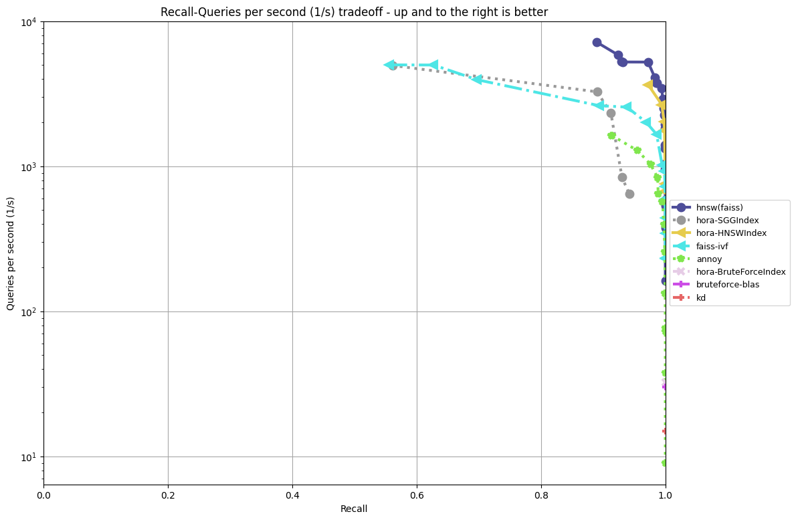

<div align="center">
  
</div>

# hora-ios

**[[Homepage](http://horasearch.com/)]** **[[Document](https://horasearch.com/doc)]** **[[Examples](https://horasearch.com/doc/example.html)]** **[[Hora](https://github.com/hora-search/hora)]** 

IOS bidding for the **`Hora Approximate Nearest Neighbor Search`**

# Key Features

* **Performant** ⚡️
  * **SIMD-Accelerated ([packed_simd](https://github.com/rust-lang/packed_simd))**
  * **Stable algorithm implementation**
  * **Multiple threads design**

* **Multiple Indexes Support** 🚀
  * `Hierarchical Navigable Small World Graph Index(HNSWIndex)` ([detail](https://arxiv.org/abs/1603.09320))
  * `Satellite System Graph (SSGIndex)` ([detail](https://arxiv.org/abs/1907.06146))
  * `Product Quantization Inverted File(PQIVFIndex)` ([detail](https://lear.inrialpes.fr/pubs/2011/JDS11/jegou_searching_with_quantization.pdf))
  * `Random Projection Tree(RPTIndex)` (LSH, WIP)
  * `BruteForce (BruteForceIndex)` (naive implementation with SIMD)

* **Portable** 💼
  * Support `no_std` (WIP, partial)
  * Support `Windows`, `Linux` and `OS X`
  * Support `IOS` and `Android` (WIP)
  * **No** heavy dependency, such as `BLAS`

* **Reliability** 🔒
  * `Rust` compiler secure all code
  * Memory managed by `Rust`
  * Broad testing coverage

* **Multiple Distances Support** 🧮
  * `Dot Product Distance`
    * 
  * `Euclidean Distance`
    * 
  * `Manhattan Distance`
    * 
  * `Cosine Similarity`
    * 

* **Productive** ⭐
  * Well documented
  * Elegant and simple API, easy to learn

# Benchmark


by `aws t2.medium (CPU: Intel(R) Xeon(R) CPU E5-2686 v4 @ 2.30GHz)` [more information](https://github.com/hora-search/ann-benchmarks)

# Usage

```bash
$ rustup target add aarch64-apple-ios aarch64-apple-ios
$ cargo install cargo-lipo
$ git clone https://github.com/hora-search/hora-ios
$ cd hora-ios/hora
$ cargo lipo --release
```

then you would got `hora/target/universal/release/libhora.a`

# License

The entire repo is under [Apache License](https://github.com/hora-search/hora/blob/main/LICENSE).